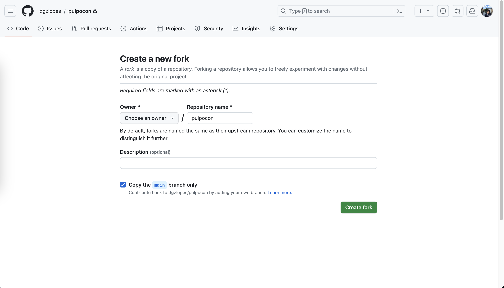

# Workshop Optimización de Pruebas de Rendimiento con k6 para DevOps
## Nerdearla 2023

Enlaces útiles: [Diapositivas](https://docs.google.com/presentation/d/1xcRIFyRC1cHii7QGyL_SvVTQbDyPirjlLaM66r6zSX4/edit?usp=sharing), [Documentación de k6](https://k6.io/docs/)

- [Workshop Optimización de Pruebas de Rendimiento con k6 para DevOps](#workshop-optimización-de-pruebas-de-rendimiento-con-k6-para-devops)
  - [Nerdearla 2023](#nerdearla-2023)
  - [0. Antes de Comenzar](#0-antes-de-comenzar)
    - [0.1. Introducción](#01-introducción)
    - [0.2. Requerimientos](#02-requerimientos)
    - [0.3.  Ejecutemos en local](#03--ejecutemos-en-local)
  - [1. Bases Fundamentales](#1-bases-fundamentales)
    - [1.1. ¿Qué diablos es Grafana k6?](#11-qué-diablos-es-grafana-k6)
    - [1.2. Ejecuta tu primera prueba](#12-ejecuta-tu-primera-prueba)
    - [1.3. Usuarios Virtuales (VUs) e Iteraciones (Iterations)](#13-usuarios-virtuales-vus-e-iteraciones-iterations)
      - [1.3.1. Tiempo de Pensamiento (Think Time)](#131-tiempo-de-pensamiento-think-time)
      - [1.3.2. Etapas (Stages)](#132-etapas-stages)
    - [1.4. Verificaciones (Checks)](#14-verificaciones-checks)
    - [1.5. Umbrales (Thresholds)](#15-umbrales-thresholds)
    - [1.6. Importar Datos desde un Archivo](#16-importar-datos-desde-un-archivo)
    - [1.7. Visualizar los Resultados a lo Largo del Tiempo con Prometheus y Grafana](#17-visualizar-los-resultados-a-lo-largo-del-tiempo-con-prometheus-y-grafana)
    - [1.8. Más cosas](#18-más-cosas)
      - [1.8.1. Ciclo de vida (Lifecycle)](#181-ciclo-de-vida-lifecycle)
      - [1.8.2. CLI, Sobrescritura y Variables de Entorno](#182-cli-sobrescritura-y-variables-de-entorno)
      - [1.8.3. Métricas Personalizadas (Custom Metrics)](#183-métricas-personalizadas-custom-metrics)
      - [1.8.4. Resumen Personalizado (Custom Summary)](#184-resumen-personalizado-custom-summary)
  - [2. Ejecutando k6 en CI (Continuous Integration)](#2-ejecutando-k6-en-ci-continuous-integration)
    - [a. GitHub Actions](#a-github-actions)
    - [b. Otros proveedores de CI](#b-otros-proveedores-de-ci)
  - [3. Cosas Avanzadas](#3-cosas-avanzadas)
    - [3.1. Escenarios](#31-escenarios)
  - [3.2. Módulos](#32-módulos)
    - [3.3. Más cosas](#33-más-cosas)
      - [3.3.1 Navegador](#331-navegador)
      - [3.3.2. Componibilidad (Composability)](#332-componibilidad-composability)
      - [3.3.3. Extensiones (Extensions)](#333-extensiones-extensions)
      - [3.3.4. WebSockets](#334-websockets)
  - [4. Más cosas](#4-más-cosas)
    - [4.1. Grafana Cloud k6](#41-grafana-cloud-k6)
    - [4.2. Inyección de Fallos](#42-inyección-de-fallos)
    - [4.3. Operador de Kubernetes](#43-operador-de-kubernetes)

<small><i><a href='http://ecotrust-canada.github.io/markdown-toc/'>Table of contents generated with markdown-toc</a></i></small>

##  0. Antes de Comenzar

### 0.1. Introducción

### 0.2. Requerimientos
- Docker & Docker Compose
- git
- Cuenta en GitHub  
- Opcional (pero recomendado): [k6](https://k6.io/docs/get-started/installation/)  
  - Puedes correrlo dentro de Docker, aunque la experiencia mejora si lo instalas localmente. 
    - ¡Tendrás colores chéveres y barras de progreso dinámicas! 
    - Además, es solo un binario, por lo que podrás quitarlo fácilmente después si decides que no lo necesitas.
  - Si planeas usar Docker, por favor, descarga previamente las imágenes con:  
    - `docker pull grafana/k6 `
    - `docker pull grafana/k6:latest-with-browser`
- [Cuenta de Grafana](https://k6.io/docs/get-started/installation/) Para que tengamos dashboard bonitos y muchas cosas mas como
  - Plan gratuito
  - 10,000 series de métricas
  - 14-dias de retención
  - 50GB de logs
  - 50GB de trazas
  - 50GB de profiling
  - 500VUh de k6 testing
  - Hasta 3 personas
  - y finalmente Grafana 

###  0.3.  Ejecutemos en local

primero, clonamos el repo: 
```bash
git clone https://github.com/jwcastillo/workshop-k6-nerdearla2023
```

Ahora ejecutamos, ¡Vamos allá!
```bash
cd workshop-k6-nerdearla2023/; docker-compose up -d
```
Una vez que el universo Docker se alinee, dirígete a http://localhost:3333 y dale un clic al gran botón. ¡Si una recomendación de pizza aparece, estás en el camino correcto!

No te olvides de espiar http://localhost:3000 para verificar la presencia de una instancia de Grafana.

    
## 1. Bases Fundamentales
### 1.1. ¿Qué diablos es Grafana k6?
### 1.2. Ejecuta tu primera prueba

Bien, el primer paso en nuestra misión es copiar el siguiente script:

```javascript
import http from "k6/http";

const BASE_URL = __ENV.BASE_URL || 'http://localhost:3333';

export default function () {
  let restrictions = {
    maxCaloriesPerSlice: 500,
    mustBeVegetarian: false,
    excludedIngredients: ["pepperoni"],
    excludedTools: ["knife"],
    maxNumberOfToppings: 6,
    minNumberOfToppings: 2
  }
  let res = http.post(`${BASE_URL}/api/pizza`, JSON.stringify(restrictions), {
    headers: {
      'Content-Type': 'application/json',
      'X-User-ID': 23423,
    },
  });
  console.log(`${res.json().pizza.name} (${res.json().pizza.ingredients.length} ingredients)`);
}
```

Pégalo en un archivo llamado example.js, y luego, ejecútalo con:


```bash
# Si tienes k6 instalado
k6 run example.js
# Si no tienes k6 instalado
docker run -i --network=workshop-k6-nerdearla2023_default grafana/k6 run -e BASE_URL=http://quickpizza:3333  - <example.js
# Si no tienes k6 instalado y eres flojo para escribir
./docker-run.sh example.js
```

¡Voilá! Has ejecutado con éxito tu primera prueba.

Ahora, puedes ver muchos datos en la salida. Los datos se dividen en tres secciones principales en la salida de k6: 
  1. Información sobre la prueba y su configuración.
     - Por qué: Para entender rápidamente la configuración de la prueba y cómo se ejecutará.
  2. Información en tiempo real (por ejemplo, registros).
     - Por qué: Para entender qué está sucediendo durante la prueba.
  3. Resumen de la prueba.
     - Por qué: Para entender cómo fue la prueba.


Conocer la salida de k6 es esencial, ya que la estarás utilizando mucho.

En la segunda sección de la salida, deberías ver una línea de registro con el nombre de la pizza y el número de ingredientes. Esto ocurre una vez porque k6 ha ejecutado tu función predeterminada una vez. También puedes ver en la tercera sección muchas métricas que k6 ha generado y agregado para ti. Estas métricas son útiles para entender cómo fue la prueba (por ejemplo, el número de solicitudes, errores, tiempo de respuesta, etc.).


### 1.3. Usuarios Virtuales (VUs) e Iteraciones (Iterations)
En k6, tenemos dos conceptos principales: Usuarios Virtuales (VUs) e Iteraciones (Iterations). Un VU es un usuario virtual. Es un hilo que ejecuta tu script. Es la unidad básica de ejecución en k6. Una Iteración (Iteration) es una ejecución única de tu script. En el ejemplo anterior, es una ejecución única de tu función predeterminada.

Puedes pensar en esto como un bucle for. Puedes tener muchos de esos; cada uno ejecutará tu script. El número de iteraciones es la cantidad de veces que tu script se ejecutará. El número de VUs es la cantidad de hilos que ejecutarán tu script.

Tambien puedes imaginar que la prueba en k6 es una orquesta. Los Usuarios Virtuales (VUs) son los músicos y las Iteraciones (Iterations) son las piezas musicales.
  - Usuarios Virtuales (VUs): Cada músico (VU) tiene la habilidad de tocar una pieza musical (ejecutar un script).
  - Iteraciones (Iterations): La pieza musical (script) que es interpretada (ejecutada) por cada músico (VU).

Así como en una orquesta, varios músicos (VUs) pueden tocar múltiples piezas (Iteraciones) en un concierto (prueba), en k6, varios VUs pueden ejecutar múltiples Iteraciones durante una prueba.


Cuando ejecutas una prueba de k6, por defecto, ejecutará tu script una vez, con un solo VU. Esto es útil para verificar que tu script funcione como se esperaba. Sin embargo, no es muy útil para entender cómo se comporta tu sistema con una carga sostenida durante algún tiempo. Necesitas aumentar el número de VUs y cambiar la duración de la prueba para hacerlo.

¡Vamos a probarlo! Después de las importaciones, agrega un bloque de configuración a tu script:
```javascript
export let options = {
  vus: 10,
  duration: "5s",
};
```

Luego, ejecútalo de nuevo.

Deberías ver muchas más líneas de registro con recomendaciones de pizza en la salida. Muchas cosas cambian en la salida cuando aumentas el número de VUs y la duración, como los valores de las métricas de VUs e iteraciones, el número de solicitudes, el tiempo de respuesta, etc.

#### 1.3.1. Tiempo de Pensamiento (Think Time)

¡Es maravilloso ver los resultados en tiempo real! Sin embargo, hemos notado que estamos sobrecargando el servicio un tanto. Actualmente no hay un intervalo o tiempo de reflexión entre las iteraciones, lo cual no simula el comportamiento real de un usuario. Es hora de incorporar un tiempo de espera (sleep) para ser más considerados y realistas:

```javascript
// agrega esto en el top del archivo
import { sleep } from 'k6';

// Agrega esto al final de la funcion default 
sleep(1);
```

Después, ejecuta el script nuevamente.

Ahora, estamos obteniendo una recomendación de pizza cada segundo, lo que es mucho más realista. El número de iteraciones se ha vuelto más predecible. Si tienes 10 VUs y un tiempo de espera de 1 segundo, ¡deberías lograr diez iteraciones por segundo! Sin embargo, a veces, esto puede no cumplirse al pie de la letra debido a que k6 necesita un cierto tiempo para iniciar los VUs. Pero no te preocupes, esto es algo que puedes ajustar en la configuración si lo necesitas (hablaremos sobre los Escenarios (Scenarios) más adelante).

La incorporación del Tiempo de Reflexión es esencial ya que nos permite simular el comportamiento real de los usuarios de una manera más precisa. Los usuarios reales no realizan acciones en un sitio web de manera continua sin pausas; toman su tiempo para leer la información, pensar y luego actuar. Por lo tanto, añadir un tiempo de espera entre las iteraciones hace que nuestras pruebas sean más realistas y nos proporciona datos más precisos sobre cómo se comportaría nuestro sistema bajo una carga de usuario más auténtica.

Si deseas aumentar o disminuir las solicitudes por segundo, puedes modificar el número de VUs (¡o el tiempo de espera!). Esto te dará la flexibilidad de simular diferentes niveles de carga y entender cómo se desempeña tu servicio bajo diferentes condiciones, lo cual es invaluable para garantizar una experiencia de usuario satisfactoria y la robustez del sistema.

#### 1.3.2. Etapas (Stages)

Ahora, vamos a adentrarnos en un escenario más realista. Es vital simular cómo se comportará nuestro servicio ante un flujo de usuarios que aumenta progresivamente, alcanza un pico y luego disminuye. Esto nos ayudará a entender y prepararnos para diversos escenarios de uso real.

Esta simulación la podemos lograr utilizando las etapas (stages) en k6.

Reemplaza el bloque de options con el siguiente código:
```javascript
export let options = {
  stages: [
    { duration: "5s", target: 10 },
    { duration: "10s", target: 10 },
    { duration: "5s", target: 0 },
  ],
};
```

Ahora, ejecuta el script de nuevo.

¿Qué es lo que está haciendo k6 ahora?

- Durante los primeros 5 segundos, k6 incrementará el número de VUs de 0 a 10, simbolizando un aumento gradual de usuarios.
- Luego, mantendrá estas 10 VUs activas durante 10 segundos, representando un período de actividad constante.
- Finalmente, en los últimos 5 segundos, disminuirá el número de VUs de 10 a 0, simbolizando una disminución en la actividad del usuario.

Las Etapas son cruciales para emular diferentes escenarios de tráfico en nuestro servicio. Nos proporciona una imagen clara de cómo se comportará nuestro sistema bajo diferentes condiciones de carga, lo que a su vez nos permite hacer ajustes necesarios para garantizar un rendimiento óptimo.

> **NOTA:** Si estás utilizando Docker para ejecutar esta prueba, es probable que la salida se vea desordenada. Puedes remediar esto añadiendo la bandera --quiet al comando de k6. ¿La razón? Al usar la interfaz de línea de comandos (CLI), obtienes una barra de progreso elegante que te muestra cuántos VUs están en ejecución y cómo se está desempeñando tu prueba en tiempo real. Sin embargo, al usar Docker, k6 incluirá esta barra de progreso en los registros (logs), lo que puede desordenar la salida.

> **CONSEJO:** Si necesitas terminar la prueba antes de lo previsto, simplemente presiona CTRL+C. A pesar de la interrupción, k6 generará un resumen con los datos recopilados hasta ese momento, permitiéndote aún así tener una visión inicial del comportamiento del servicio bajo la carga simulada. Esto se traduce en flexibilidad y control sobre las pruebas, permitiéndote adaptarte a diferentes situaciones durante el proceso de prueba.


### 1.4. Verificaciones (Checks)

Un problema adicional con nuestro script es que no estamos validando si el servicio está funcionando como se espera. Simplemente estamos enviando solicitudes a ciegas y esperando lo mejor. ¡Podemos hacerlo mejor! Podemos añadir verificaciones (checks) a nuestro script.

Las Verificaciones (Checks) son como afirmaciones (assertions). Son una manera de verificar que una condición se está cumpliendo.

Vamos a añadir una verificación (check) a nuestro script, para validar que el estado de la respuesta HTTP sea 200.

Primero, necesitamos importar la función `check`:
```javascript
import { check } from "k6";
```

Luego, podemos agregar una verificación a nuestro script. Solo necesitas agregar las siguientes líneas después de la solicitud:

```javascript
check(res, {
  "is status 200": (r) => r.status === 200,
});
```

Después, vuelve a ejecutar el script.

Ahora, deberías ver una nueva sección en la salida con los resultados de las verificaciones. Deberías ver que todas las verificaciones han pasado. ¡Eso es bueno!

Si deseas ver qué sucede cuando una verificación falla, puedes cambiar la verificación a:
```javascript
check(res, {
  "is status 200": (r) => r.status === 500,
});
```

Puedes aprender más sobre verificaciones [en la documentación.](https://k6.io/docs/using-k6/checks/).

Las Verificaciones (Checks) son un pilar esencial en la estrategia de pruebas, especialmente para un profesional DevOps. Incorporar estas validaciones permite que el proceso de pruebas sea más robusto y significativo. Un DevOps se beneficia enormemente de esta capacidad ya que facilita la identificación y diagnóstico de problemas, y asegura que los servicios están respondiendo correctamente bajo diferentes condiciones de carga.


### 1.5. Umbrales (Thresholds)

Los Umbrales (Thresholds) son los criterios de aprobación o reprobación que defines para las métricas de tu prueba. Si el sistema bajo prueba (SUT, por sus siglas en inglés) no cumple con las condiciones de tu umbral, la prueba termina con un estado fallido. Esto significa que k6 saldrá con un código de salida distinto de cero. Puedes aprovechar las métricas estándar que genera k6 o las métricas personalizadas que defines en tu script (veremos más sobre esto más adelante).

Los Umbrales (Thresholds) se presentan como una herramienta crucial para los DevOps, permitiéndome como profesional establecer criterios claros de rendimiento y funcionamiento que el sistema bajo prueba debe cumplir. Esta capacidad de establecer umbrales brinda un indicador claro y cuantificable sobre la calidad y la eficiencia del sistema que estamos probando.

Al establecer Umbrales, puedo configurar ciertos límites en las métricas, lo que facilita mucho la interpretación de los resultados de las pruebas. Por ejemplo, si estoy esperando que el 95% de las solicitudes se complete en menos de 5 segundos y eso no ocurre, sé que hay algo que necesito revisar y optimizar. Esto es especialmente útil en un entorno DevOps, donde la eficiencia y la rapidez en la identificación y resolución de problemas es crucial.

Los Umbrales también fomentan un ciclo de mejora continua. Cada vez que un umbral falla, se convierte en una oportunidad para optimizar, aprender y mejorar, garantizando que los servicios que estoy operando o desarrollando sean robustos y confiables. También me da una sensación de confianza y control, ya que puedo definir, en términos muy concretos, cómo quiero que se comporte el sistema bajo diferentes condiciones de carga, lo cual es esencial en un mundo donde la satisfacción del usuario final es primordial.

Agreguemos un umbral a nuestro script. Puedes hacerlo cambiando el bloque `options` a:
```javascript
export let options = {
  stages: [
    { duration: "5s", target: 10 },
    { duration: "10s", target: 10 },
    { duration: "5s", target: 0 },
  ],
  thresholds: {
    "http_req_duration": ["p(95)<5000"],
  },
};
```

Luego, vuelve a ejecutar el script. Deberías ver algo cerca de la sección de métricas diciendo que el umbral pasó.

Este umbral está diciendo que el 95% de las solicitudes deberían ser más rápidas que 5 segundos. Si ese no es el caso, el umbral falla.

Para ver qué sucede cuando un umbral falla, puedes cambiar el umbral a:
```javascript
export let options = {
  stages: [
    { duration: "5s", target: 10 },
    { duration: "10s", target: 10 },
    { duration: "5s", target: 0 },
  ],
  thresholds: {
    "http_req_duration": ["p(95)<10"],
  },
};
```

También puedes inspeccionar el código de estado de la prueba con:

```bash
# Si tienes k6 instalado, ejecuta esto después de que la prueba termine
echo $?

# Si no tienes k6 instalado
docker run -i --network=workshop-k6-nerdearla2023_default grafana/k6 run -e BASE_URL=http://quickpizza:3333  - <example.js; echo $?
```

Luego, vuelve a ejecutar el script.

Hay otra forma de definir umbrales que es un poco más flexible. Incluso te permite abortar la prueba si un umbral falla. Por ejemplo, podrías reescribir el umbral anterior como:
```javascript
thresholds: {
  "http_req_duration": [
    { threshold: "p(95)<10", abortOnFail: false },
  ],
},
```

Puedes aprender más sobre umbrales [en la documentación](https://k6.io/docs/using-k6/thresholds/).

### 1.6. Importar Datos desde un Archivo

La habilidad de importar datos desde un archivo se convierte en una ventaja significativa, especialmente desde una perspectiva de DevOps. Ahora, ya no estamos limitados a datos codificados y podemos simular escenarios más realistas. Imagínalo como tener una lista de ingredientes de diferentes proveedores, cada vez que preparamos una receta, podemos optar por diferentes combinaciones, lo que resulta en diferentes sabores y experiencias. La dinámica es similar aquí; cada ID de cliente puede tener diferentes comportamientos y patrones en la aplicación, lo que aporta más realismo a nuestras pruebas.

La biblioteca ShareArray es particularmente útil. Actúa como un estante en una biblioteca, donde se almacenan varios libros (datos). Una vez que los libros están en el estante, cualquier persona (o en nuestro caso, cualquier Unidad Virtual) puede acceder a ellos y leerlos. Pero la ventaja es que no tienes que poner los libros en el estante una y otra vez; una vez que están ahí, están disponibles para todos.

En un escenario real, los DevOps pueden tener múltiples entornos y necesitan asegurarse de que las aplicaciones funcionen según lo esperado en todos ellos. La parametrización de datos nos permite probar cómo se comporta nuestra aplicación con diferentes entradas sin tener que codificarlas manualmente en nuestro script. Esto ahorra tiempo, reduce errores y asegura que nuestras pruebas sean robustas y representativas del comportamiento real de los usuarios.

Esta práctica se alinea con los principios de la integración y entrega continua (CI/CD) al facilitar pruebas más completas y realistas, lo que a su vez contribuye a la entrega de software de alta calidad. Es como tener un equipo de chefs que prueban nuevas recetas con diferentes ingredientes, siempre buscando la combinación perfecta que deleitará a los comensales. La flexibilidad y la capacidad de adaptarse a diferentes datos y escenarios son cruciales, y el hecho de que pueda automatizar este proceso y hacerlo de manera eficiente es una victoria clara en el mundo DevOps.

Volviendo a la obra tenemos que hasta ahora, hemos estado utilizando algunos datos codificados. ¡Vamos a cambiar eso!

Haremos que el customerID (ID del cliente) que agregamos a cada solicitud sea dinámico, con datos provenientes de un archivo JSON.

Para lograrlo, primero necesitamos crear un archivo llamado `customers.json` con algunos IDs de cliente:
```json
{
  "customers": [
    12351,
    12352,
    12353,
    12354,
    12355,
    12356
  ]
}
```

Luego, necesitamos cargar estos datos en k6. Hay múltiples formas de hacerlo, pero una de las más sencillas y óptimas es utilizando nuestra biblioteca ShareArray (Array Compartido). Esta biblioteca cargará los datos una vez y permitirá que todos los VUs (Unidades Virtuales) los lean.

Para usarlo, necesitamos importarlo:
```javascript
import { SharedArray } from "k6/data";
```

Luego, necesitamos cargar los datos:

```javascript
// Add this line after the options block, outside of the default function - we want to load the data once!
const customers = new SharedArray('all my customers', function () {
  return JSON.parse(open('./customers.json')).customers;
});
```

Finalmente, podemos usarlo en nuestro script. Reemplacemos la solicitud HTTP con:

```javascript
let res = http.post(`${BASE_URL}/api/pizza`, JSON.stringify(restrictions), {
  headers: {
    'Content-Type': 'application/json',
    'X-User-ID': customers[Math.floor(Math.random() * customers.length)],
  },
});
```

> **NOTA:** Si estás utilizando docker, necesitas montar el archivo`customers.json`. Puedes hacerlo agregando la siguiente bandera al comando docker: `-v $(pwd)/customers.json:/customers.json`.

De esta manera, elegiremos un cliente aleatorio de la lista de clientes. Luego, vuelve a ejecutar el script.

Si revisas los registros del servicio QuickPizza, deberías ver que el ID del cliente que adjuntamos a cada línea de registro está cambiando todo el tiempo.

Puedes verificar esto ejecutando  `docker-compose logs quickpizza`.

Puedes aprender más sobre umbrales [en la documentación](https://k6.io/docs/examples/data-parameterization/).

### 1.7. Visualizar los Resultados a lo Largo del Tiempo con Prometheus y Grafana
La visualización de datos a lo largo del tiempo se convierte en una herramienta esencial para comprender el comportamiento y la performance de los sistemas, especialmente desde la perspectiva de un profesional DevOps. Imagina que eres un capitán navegando por los vastos mares de datos. Sin un mapa y una brújula (en este caso, Prometheus y Grafana), sería desafiante entender la dirección en la que te estás moviendo y si estás cerca de alcanzar tus destinos de rendimiento deseados.

Prometheus actúa como una especie de faro, recogiendo señales de tus métricas y proporcionando un punto de referencia constante. Por otro lado, Grafana es como tu mapa y brújula, ofreciéndote una representación visual clara de dónde estás y cómo han evolucionado las cosas con el tiempo.

Estas herramientas no solo hacen que los datos sean fácilmente interpretables, sino que también permiten un monitoreo en tiempo real que es crucial para la detección temprana y la solución de problemas en un entorno DevOps. Asimismo, la capacidad de visualizar métricas en tiempo real proporciona una ventana hacia cómo los cambios recientes, ya sean nuevas implementaciones o configuraciones, están afectando al sistema. Esto resuena con el enfoque proactivo de DevOps de identificar y abordar los problemas antes de que puedan afectar a los usuarios finales o amplificar los costos operativos.

La integración de k6 con Prometheus y Grafana simplifica este proceso, proporcionando una plataforma donde puedes ver cómo las métricas evolucionan en tiempo real, todo en un entorno bien organizado y visualmente agradable. Es como tener una sala de control desde donde puedes monitorear cada ola y corriente en tu océano de datos, asegurándote de que tu barco esté navegando en la dirección correcta hacia un rendimiento óptimo.

Al ajustar cómo invocas k6 y al agregar la salida de Prometheus, has abierto una nueva ventana de análisis y monitoreo que te permitirá, a ti y a tu equipo, tomar decisiones informadas basadas en datos confiables y actualizados. Este paso hacia una visualización más clara y un análisis más profundo es un salto significativo hacia la gestión eficiente y efectiva de tus operaciones de DevOps.

Como hemos visto en las ejecuciones anteriores, la salida de k6 es... agradable, pero no es posible entender cómo las métricas evolucionaron con el tiempo.

Para resolver esto, k6 tiene Salidas (Outputs). Estas te permiten exportar tus métricas/registros a otro lugar en tiempo real. Una de las salidas más populares es la salida de Prometheus (Prometheus Output). Esta salida exportará tus métricas a una instancia de Prometheus, por lo que podrás usar Grafana para visualizar las métricas en tiempo real.

El entorno de Docker Compose ya tiene una instancia de Prometheus y Grafana en ejecución. ¡Así que vamos a utilizarlo!

Solo necesitas cambiar cómo invocas k6, y agregar la salida de Prometheus:
```bash
# Si tienes k6 instalado
k6 run --out=experimental-prometheus-rw example.js

# Si no tienes k6 instalado
docker run -i --network=workshop-k6-nerdearla2023_default grafana/k6 run --out=experimental-prometheus-rw -e BASE_URL=http://quickpizza:3333 -e K6_PROMETHEUS_RW_SERVER_URL=http://prometheus:9090/api/v1/write - <example.js
```

Luego, ejecuta el script nuevamente. Después de eso, abre http://localhost:3000. 

Luego, ve a los paneles (dashboards) y haz clic en el panel de k6 ([esta es la url del dashboard](http://localhost:3000/d/e53a57f8-56e2-4b0c-88f4-9537296a3f48/k6-dashboard?orgId=1&refresh=10s)). 

Deberías ver un panel con algunas métricas, que se están actualizando en tiempo real.


> NOTA: ¿Por qué esta característica es experimental? Solo porque se ha agregado recientemente a k6. Pero ya es muy estable y es utilizada por muchas personas.

> CONSEJO: Debido a cómo funcionan las métricas de Prometheus, las métricas estarán activas durante cinco minutos después de la última muestra sea cargada. Esto puede ser confuso porque las métricas continuarán con el último valor incluso si la prueba ya ha terminado. Para evitar esto, puedes utilizar la siguiente variable de entorno: `K6_PROMETHEUS_RW_STALE_MARKERS=true`.

Puedes aprender más sobre [salidas](https://k6.io/docs/results-output/overview/) en la documentación.

### 1.8. Más cosas

En caso de que tengas tiempo (ahora o más tarde), aquí hay algunas cosas más que puedes aprender y probar.

#### 1.8.1. Ciclo de vida (Lifecycle)

En k6, los cuatro estados del ciclo de vida de una prueba son cruciales para entender y organizar adecuadamente tu script de prueba. Estos estados son:

```javascript
// 1. código de inicialización

export function setup() {
  // 2. código de configuración

}

export default function (data) {
  // 3. código VU
}

export function teardown(data) {
  // 4. código de finalización
}
```

- **Inicialización (init):**
  - **Requerido**
  - Este no es realmente un estado específico en la sintaxis de k6, pero es el periodo durante el cual se inicializan todas las VUs.
  - Durante esta fase, cada VU ejecuta su código de arriba hacia abajo, pero no ejecuta la función default aún.
  - La inicialización de VUs es donde puedes importar bibliotecas grandes, hacer cálculos complicados, o realizar otras operaciones intensivas que no deseas incluir en la medición del rendimiento de la prueba.
  - El código en el contexto de inicialización prepara el script, cargando archivos, importando módulos y definiendo las funciones del ciclo de vida de la prueba.
- **Configuración (setup):**
  - **Opcional**
  - La función setup se ejecuta una sola vez, al comienzo de la prueba, antes de que cualquier VU (Unidad Virtual) se inicialice o se ejecute alguna iteración.
  - Es útil para establecer conexiones, preparar datos o cualquier otra actividad de configuración que necesites hacer antes de que comiencen las pruebas.
  - La función de configuración se ejecuta, preparando el entorno de prueba y generando datos.
- **Prueba (default):**
  - **Requerido**.
  - La función default contiene el código que cada VU ejecutará en un bucle durante la duración de la prueba.
  - Es aquí donde suelen ir las operaciones principales que deseas probar, como las solicitudes HTTP.
  - El código VU se ejecuta en la función predeterminada o de escenario (lo mencionaremos más adelante), corriendo por tanto tiempo y tantas veces como lo definan las opciones.
- **Finalización (teardown):**
  - **Opcional**
  - La función teardown se ejecuta una sola vez, después de que todas las VUs hayan terminado de ejecutarse.
  - Es útil para cerrar conexiones, limpiar recursos, o cualquier otra actividad de limpieza que necesites hacer después de que las pruebas hayan terminado.
  - La función de finalización se ejecuta, procesando los datos posteriormente y cerrando el entorno de prueba.


Puedes utilizar las funciones del ciclo de vida para hacer cosas como, ¡no ejecutar la prueba si el servicio está inactivo! Podrías hacer algo así agregando el siguiente código a tu script:

```javascript
export function setup() {
  let res = http.get(BASE_URL)
  if (res.status !== 200) {
    throw new Error(`Got unexpected status code ${res.status} when trying to setup. Exiting.`)
  }
}
```

Puedes aprender más [en la documentación](https://k6.io/docs/using-k6/test-lifecycle/).

#### 1.8.2. CLI, Sobrescritura y Variables de Entorno 

La mayoría de las cosas que puedes configurar en el bloque `options` también pueden ser sobrescritas a través de la CLI (Interfaz de Línea de Comandos). Por ejemplo, puedes sobrescribir el número de VUs con la bandera  `--vus` y la duración con la bandera `--duration`.

Esto significa que el mismo script puede ser utilizado para ejecutar diferentes pruebas. Puedes tener un solo script que puedes usar para ejecutar una prueba de humo (smoke test), una prueba de carga (load test), una prueba de saturación (soak test), etc. ¡Solo necesitas cambiar los argumentos de la CLI!


Alternativamente, puedes controlar la configuración de la prueba a través de variables de entorno. Tenemos muchas de ellas, pero también puedes crear las tuyas y modificar el comportamiento de tu script en función de estas. Además, puedes utilizar variables de entorno para pasar secretos a tu script (por ejemplo, claves API).

Puedes pasar variables de entorno a k6 de múltiples maneras:
```bash
k6 run -e MY_ENV_VAR=123 example.js
# or
MY_ENV_VAR=123 k6 run example.js
```

Luego, puedes utilizarla en tu script con el objeto `__ENV`:
```javascript
console.log(__ENV.MY_ENV_VAR);
```

Si te diste cuenta, hemos estado utilizando la variable de entorno  `BASE_URL` para pasar la URL del servicio QuickPizza a nuestro script. ¡Es por eso que podemos ejecutar el mismo script localmente y en Docker sin cambiar nada!

Esta característica de sobrescribir configuraciones desde la línea de comandos o a través de variables de entorno introduce un alto grado de flexibilidad y control sobre cómo se ejecutan las pruebas. Para un profesional en DevOps, esta flexibilidad es de gran valor.

Imagina que estás en una orquesta, y el script es tu partitura. Dependiendo del evento o la audiencia, podrías querer cambiar el tempo o incluso algunos instrumentos. Con las sobrescripciones de la CLI y las variables de entorno, es como tener la capacidad de ajustar tu interpretación en tiempo real, sin necesidad de reescribir toda la partitura.

Las variables de entorno también ofrecen una forma segura y eficaz de manejar información sensible, como las claves API. Es como tener un cofre fuerte en el escenario, donde puedes guardar y acceder a los elementos valiosos necesarios para tu interpretación.

El uso de variables de entorno y sobrescripciones de la CLI no solo simplifica la configuración de las pruebas, sino que también permite una reutilización efectiva del script en diferentes escenarios y entornos, desde pruebas locales hasta pruebas en entornos Docker. Esto resonará bien con los esfuerzos de optimización y automatización que son esenciales en un ambiente DevOps, permitiendo una gestión más fluida y controlada de las configuraciones de pruebas.

Además, al poder alterar los parámetros de las pruebas fácilmente, puedes adaptarte rápidamente a diferentes requisitos de pruebas o responder a los hallazgos de pruebas anteriores sin tener que sumergirte en el código del script cada vez. En última instancia, estas características contribuyen a hacer de la gestión y ejecución de pruebas una tarea menos compleja y más adaptable, lo cual es fundamental en el dinámico mundo de DevOps.


Puedes aprender más en la documentación de [how to options](https://k6.io/docs/using-k6/k6-options/how-to/) y [environment variables](https://k6.io/docs/using-k6/environment-variables/).

#### 1.8.3. Métricas Personalizadas (Custom Metrics)

Por defecto, k6 recopila automáticamente métricas incorporadas. Además de estas, también puedes crear métricas personalizadas.

Las métricas se dividen en cuatro tipos amplios:

- Contadores (Counters): suman valores.
- Medidores (Gauges): rastrean los valores más pequeños, más grandes y los más recientes.
- Tasas (Rates): rastrean la frecuencia con la que ocurre un valor no nulo.
- Tendencias (Trends): calculan estadísticas para múltiples valores (como la media, moda o percentil).


La utilidad de las métricas personalizadas radica en su capacidad para reflejar aspectos específicos del sistema que estás probando, lo cual es crucial para un análisis detallado y efectivo. Por ejemplo, en el caso de QuickPizza, poder rastrear el número de pizzas recomendadas y los ingredientes por pizza proporciona insights valiosos sobre cómo el sistema maneja las recomendaciones y cómo varían los ingredientes, lo cual puede ser vital para la satisfacción del cliente y la eficiencia operacional.

¡Vamos a probarlo!

Para QuickPizza, vamos a crear una métrica personalizada para rastrear el número de pizzas que se han recomendado y otra para rastrear el número de ingredientes que tiene cada pizza. Primero necesitas importar la biblioteca de métricas:
```javascript
import { Trend, Counter } from "k6/metrics";
```

Luego, puedes crear las métricas:

```javascript
// Coloca esto después del bloque de opciones, fuera de la función predeterminada
const pizzas = new Counter('quickpizza_number_of_pizzas');
const ingredients = new Trend('quickpizza_ingredients');
```

Más tarde, en la función predeterminada, puedes usar tus métricas después de que se haya realizado la solicitud HTTP:

```javascript
// Incrementamos el número de pizzas en 1
pizzas.add(1);

// Añadimos el número de ingredientes de la pizza a la tendencia
ingredients.add(res.json().pizza.ingredients.length);
```

Cuando ejecutes la prueba, deberías poder ver estas nuevas métricas en la sección de resumen de la salida.

Al facilitar la creación y utilización de métricas personalizadas, k6 se convierte en una herramienta robusta y adaptable que permite a los profesionales de DevOps tener un mejor control y entendimiento del comportamiento del sistema, lo cual es fundamental para garantizar la fiabilidad y eficiencia del mismo en diferentes etapas (stages) y escenarios. También promueve una cultura de mejora continua y análisis profundo, pilares en cualquier estrategia DevOps exitosa.


Puedes aprender más [en la documentación](https://k6.io/docs/using-k6/metrics/).

#### 1.8.4. Resumen Personalizado (Custom Summary)

Ya has visto en múltiples ocasiones el resumen al final de la prueba. ¡Puedes personalizarlo!

Para personalizarlo, necesitas aprovechar la función `handleSummary`.

Después de que tu prueba se ejecuta, k6 agrega tus métricas en un objeto JavaScript. La función `handleSummary()` toma este objeto como argumento (llamado data en todos los ejemplos aquí).

Utiliza `handleSummary()` para crear un resumen personalizado o devolver el objeto predeterminado.

Probémoslo. Agrega, al final de tu script, lo siguiente:
```javascript
export function handleSummary(data) {
  return {
    'summary.json': JSON.stringify(data), //el objeto de datos predeterminado
  };
}
```
Si ejecutas la prueba nuevamente, deberías ver un nuevo archivo llamado `summary.json` con todos los datos que el resumen tendría.

Fundamentalmente, `handleSummary()` es simplemente una función que puede acceder a un objeto de datos. Como tal, puedes transformar los datos del resumen en cualquier formato de texto: JSON, HTML, consola, XML, y así sucesivamente. Puedes dirigir tu resumen personalizado a la salida estándar o al error estándar, escribirlo en un archivo o enviarlo a un servidor remoto.

k6 llama a `handleSummary()` al final del ciclo de vida de la prueba.

Esta capacidad de personalización del resumen en k6 es un recurso poderoso, pues permite una adaptabilidad a la singularidad de cada proyecto. Por ejemplo, un equipo de DevOps trabajando en un servicio de entrega de comida, como QuickPizza, podría querer tener un resumen específico que refleje métricas cruciales como el tiempo de respuesta, el número de pedidos procesados, o la frecuencia de errores. Por otro lado, un equipo trabajando en un servicio de streaming podría estar más interesado en métricas como la tasa de bits, la latencia o el buffer. Cada dominio tiene sus propias métricas clave y `handleSummary()` proporciona la flexibilidad para focalizar la atención en lo que realmente importa.

Adicionalmente, el poder enviar este resumen personalizado a diferentes destinos como una salida estándar, un archivo o un servidor remoto, proporciona una flexibilidad adicional para integrarse con otros sistemas y flujos de trabajo, lo cual es un aspecto vital en un entorno DevOps moderno y ágil. Por último, al ser una función que se ejecuta al final del ciclo de vida de la prueba, `handleSummary()` se alinea con la etapa de revisión y análisis en el flujo de trabajo de prueba, ayudando a cerrar el bucle de feedback y preparar el terreno para las iteraciones futuras.

Puedes aprender más [en la documentación](https://k6.io/docs/results-output/end-of-test/custom-summary/).

## 2. Ejecutando k6 en CI (Continuous Integration)

Este proceso es particularmente útil en entornos DevOps, donde la entrega rápida y continua es una necesidad. Al incorporar pruebas de rendimiento en el flujo de trabajo de CI, se establece un puente entre el desarrollo y las operaciones, asegurando no solo la funcionalidad sino también la eficiencia y la resiliencia del sistema ante diferentes cargas de trabajo.

En un entorno real, los equipos de desarrollo y operaciones pueden configurar umbrales (thresholds) específicos de rendimiento que el código debe cumplir para pasar la fase de CI. Esto actúa como una primera línea de defensa contra el degradamiento del rendimiento, y proporciona una retroalimentación temprana y valiosa a los desarrolladores sobre el impacto de sus cambios.

### a. GitHub Actions

La integración de k6 en un entorno de Integración Continua (CI) como GitHub Actions, simplifica y automatiza el proceso de pruebas de rendimiento, permitiendo una detección temprana y eficaz de posibles cuellos de botella o problemas de rendimiento en las aplicaciones. Esta automatización se asemeja a tener un vigilante atento que supervisa continuamente la calidad del código en relación con su rendimiento, garantizando que cada nuevo cambio o adición al código no degrade la experiencia del usuario final.


Vamos a utilizar GitHub Actions para ejecutar una de nuestras pruebas. Puedes hacer esto de varias maneras (instalándolo manualmente, con el contenedor Docker, etc.), pero en este caso, vamos a usar la acción de k6 en GitHub.

Comienza haciendo fork a este repositorio (sí, el repositorio):


En el repositorio bifurcado, ve a la pestaña de Acciones (Actions) y haz clic en el botón verde que habilita GitHub Actions.


Después de eso, puedes ir a tu repositorio bifurcado y editar el archivo `.github/workflows/main.yml`:


Añade lo siguiente al archivo:
```yaml
name: Testing QuickPizza
on: push

jobs:
  runner-job:
    runs-on: ubuntu-latest

    services:
      quickpizza:
        image: ghcr.io/grafana/quickpizza-local:0.3.0
        ports:
          - 3333:3333

    steps:
      - name: Checkout
        uses: actions/checkout@v3
  
      - name: Run local k6 test
        uses: grafana/k6-action@v0.3.0
        with:
          filename: script.js
        env:
          BASE_URL: "http://quickpizza:3333"
          THRESHOLD: env.THRESHOLD
```

Este flujo de trabajo (workflow) se ejecutará cada vez que hagas push *algo* a tu repositorio. Iniciará un contenedor QuickPizza en segundo plano y ejecutará el script `script.js` contra él. Puedes ver el contenido del script en el archivo `script.js`.

La prueba es muy similar a la que creaste anteriormente.

¡Eso es todo! Para cada nuevo commit, GitHub ejecutará tu prueba y te dirá si pasó o falló. Utiliza la UI (como lo hicimos antes para cambiar el flujo de trabajo), modifica el README (cualquier cambio funcionará) y comete los cambios.

Luego, ve a la pestaña de Acciones (Actions) y observa cómo se está ejecutando el flujo de trabajo.


Puedes hacer clic en el flujo de trabajo y luego hacer clic en el cuadro runner-job.

Allí, verás todos los pasos que se ejecutaron. ¡Puedes hacer clic en cada paso para ver los registros!

En el paso de k6, puedes ver la salida de k6:


El paso fallará si los umbrales (thresholds) no se cumplen. Puedes probar esto rápidamente reemplazando el objetivo del umbral con un valor pequeño, por ejemplo, 1 en lugar de 5000, y activando una nueva ejecución de CI.

Como puedes ver, ejecutar k6 en CI es bastante sencillo. Si deseas un ejemplo más extenso, puedes consultar [esta publicación en el blog](https://k6.io/blog/load-testing-using-github-actions/) que profundiza mucho más.

### b. Otros proveedores de CI

¡Aunque las instrucciones anteriores están dirigidas a las acciones de GitHub, puedes probar esta sección en cualquier proveedor de CI!

Tenemos guías para muchos de ellos. Puedes revisarlas [aquí](https://k6.io/docs/integrations/#continuous-integration-and-continuous-delivery).


## 3. Cosas Avanzadas

### 3.1. Escenarios

Los escenarios configuran cómo se ejecutan los VUs (Virtual Users) y las iteraciones de una manera más detallada. Con los escenarios, puedes modelar diferentes cargas de trabajo o patrones de tráfico en tus pruebas.

Los beneficios de usar escenarios incluyen:

- Organización de pruebas más fácil y flexible.
- Simulación de tráfico más realista.
- Cargas de trabajo en paralelo o secuenciales.
- Análisis de resultados granular.

Los escenarios en k6 proporcionan una forma avanzada y flexible de modelar diferentes patrones de tráfico y cargas de trabajo, lo que permite simular condiciones más cercanas a las operaciones en el mundo real. Además, al separar diferentes partes de la prueba en escenarios individuales, se facilita la organización, la ejecución y el análisis de la prueba. 

Al diseñar escenarios, puedes especificar cómo deben escalarse los VUs, cómo deben ejecutarse en paralelo o en secuencia, y también cómo deben distribuirse las iteraciones entre los VUs. Esta flexibilidad permite realizar pruebas de rendimiento más sofisticadas, como pruebas de estrés, pruebas de carga, pruebas de resistencia y pruebas de humo, todo dentro de una sola ejecución de prueba.


¡Probémoslo! Para usar escenarios, necesitas cambiar las `options` - un ejemplo sería:
```javascript
export let options = {
  scenarios: {
    smoke: {
      executor: "constant-vus",
      vus: 1,
      duration: "10s",
    },
    load: {
      executor: "ramping-vus",
      startVUs: 0,
      stages: [
        { duration: '5s', target: 5 },
        { duration: '10s', target: 5 },
        { duration: '5s', target: 0 },
      ],
      gracefulRampDown: "5s",
      startTime: "10s",
    },
  },
};
```

En este caso, hemos definido dos escenarios: `smoke` y `load`. El escenario `smoke` se ejecutará con un solo VU durante 10 segundos. El escenario `load` aumentará de 0 a 5 VUs en 5 segundos, se mantendrá en 5 VUs durante 10 segundos y luego disminuirá a 0 VUs en 5 segundos. El segundo escenario comenzará 10 segundos después del primero.

Como puedes ver, estamos usando dos tipos de ejecutores, `constant-vus` y `ramping-vus`. Estos son similares a lo que hemos visto anteriormente y están enfocados en VUs. Pero otros ejecutores se centran en el número de iteraciones y la tasa de iteración (por ejemplo, `per-vu-iterations` y `constant-arrival-rate`). 

Modifica nuestro script para usar escenarios y vuelve a ejecutar la prueba. Si estás ejecutando k6 localmente, deberías ver dos barras de progreso, una para cada escenario, que te indican cuántos VUs se están ejecutando y cómo se comporta tu prueba en tiempo real.

> CONSEJO: Puedes usar `exec` para ejecutar una función específica en tu script en lugar de la función predeterminada. Por ejemplo, podrías configurar un escenario para ejecutar la función `functionA`, y otro escenario para ejecutar la función `functionB`. Si no especificas una propiedad `exec`, k6 ejecutará la función predeterminada.

Puedes aprender más sobre escenarios [en la documentación](https://k6.io/docs/using-k6/scenarios/).

## 3.2. Módulos

Los módulos en k6 proporcionan una manera estructurada y organizada de gestionar y reutilizar código en tus scripts de pruebas de rendimiento. A través de la creación de módulos personalizados, puedes encapsular lógicas o funciones específicas que pueden ser compartidas entre diferentes scripts, permitiendo un mantenimiento más fácil y una estructura de código más limpia.

Por ejemplo, podrías tener un módulo dedicado a funciones de utilidad general, otro módulo para gestionar la autenticación y la autorización, y otro módulo para manejar las operaciones específicas de tu aplicación. Esto no solo facilita la organización del código, sino que también permite una colaboración más eficiente entre los miembros del equipo, ya que cada módulo puede ser desarrollado, probado y mantenido de forma independiente.

Además, al utilizar módulos, puedes aprovechar las funcionalidades avanzadas proporcionadas por k6 y las bibliotecas de terceros, lo que permite una mayor extensibilidad y flexibilidad en tus pruebas de rendimiento.

k6 proporciona muchos módulos integrados para funcionalidades básicas. Por ejemplo, el cliente http permite hacer solicitudes al sistema bajo prueba. Para obtener la lista completa de módulos integrados, consulta la [documentación de la API](https://k6.io/docs/javascript-api/).

Crear un módulo es fácil. Haces un archivo con las funciones que deseas exportar y las importas en tu script. ¡Vamos a intentarlo!

Primero, crea un archivo llamado `utils.js` con el siguiente contenido:
```javascript
export function getPizzaName(res) {
  return res.json().pizza.name;
}
```

Luego, impórtalo en tu script:
```javascript
import { getPizzaName } from './utils.js';
```

Finalmente, úsalo en tu script:
```javascript
// Úsalo después de la solicitud HTTP
console.log(getPizzaName(res));
```

Luego, vuelve a ejecutar el script. Deberías ver una línea de registro adicional con el nombre de la pizza en la salida.

```bash
# Si tienes k6 instalado
k6 run example.js

# Si no tienes k6 instalado (necesitarás montar el archivo extra)
docker run -i --network=workshop-k6-nerdearla2023_default -v $(pwd)/utils.js:/utils.js grafana/k6 run -e BASE_URL=http://quickpizza:3333  - <example.js
```

Puedes aprender más sobre módulos [en la documentación](https://k6.io/docs/using-k6/modules/).

### 3.3. Más cosas

#### 3.3.1 Navegador

Aunque hemos estado utilizando solicitudes HTTP hasta ahora, k6 no se limita a eso. ¡Puedes usarlo para probar todo tipo de cosas! Soporta de manera nativa otros protocolos como gRPC, WebSockets y Redis, y puedes extenderlo para soportar más (hablaremos un poco sobre las extensiones más adelante).

También puedes usarlo para interactuar y probar tus aplicaciones web, como con Playwright/Puppeteer. Este será el enfoque de esta sección. Usaremos las APIs de prueba del navegador de k6 para obtener una recomendación de pizza, tomar una captura de pantalla del resultado y verificar el rendimiento de la página (comprobando sus métricas de web vitals).

Para hacer eso, creemos un nuevo script llamado `browser.js` con el siguiente contenido:
```javascript
import { browser } from "k6/experimental/browser";
import { check } from "k6";

const BASE_URL = __ENV.BASE_URL || "http://localhost:3333";

export const options = {
  scenarios: {
    ui: {
      executor: "shared-iterations",
      options: {
        browser: {
          type: "chromium",
        },
      },
    },
  },
};

export default async function () {
  const page = browser.newPage();

  try {
    await page.goto(BASE_URL);
    check(page, {
      header:
        page.locator("h1").textContent() ==
        "¿Buscas salir de tu rutina de pizza?",
    });

    await page.locator('//button[. = "¡Pizza, por favor!"]').click();
    page.waitForTimeout(500);
    page.screenshot({ path: "screenshot.png" });
    check(page, {
      recommendation: page.locator("div#recommendations").textContent() != "",
    });
  } finally {
    page.close();
  }
}
```

Hay cosas en el script de las que ya hemos hablado, como Checks y Escenarios. Pero también hay cosas nuevas, como la importación `browser` y el objeto `page`. Estas APIs que k6 proporciona controlarán un navegador real en el fondo. En este script, vamos a la página de QuickPizza, hacemos clic en el gran botón, tomamos una captura de pantalla del resultado y verificamos que la recomendación no esté vacía.

Para ejecutar este script, debes tener un navegador Chromium instalado si ejecutas k6 localmente:
```bash
# Si tienes k6 instalado
k6 run browser.js
```

Si deseas usar Docker, puedes hacer lo siguiente:
```bash
docker run -i --network=workshop-k6-nerdearla2023_default --cap-add=SYS_ADMIN grafana/k6:master-with-browser run  -e BASE_URL=http://quickpizza:3333 - <browser.js

# Encuentra el ID del contenedor de ese contenedor que acabas de ejecutar
docker container ls -a

# Copia la captura de pantalla a tu máquina local
docker cp <container_id>:/home/k6/screenshot.png .

# Nota: Si estás utilizando un MacBook M1/M2 --> Asegúrate de tener instalado Rosetta y la virtualización habilitada en Docker.
```

Luego, abre el archivo `screenshot.png`. Deberías ver una captura de pantalla de la página de QuickPizza con una recomendación de pizza.

Además, deberías poder ver los Checks que hemos definido en la salida. Y, muchas nuevas métricas! Estas métricas están relacionadas con el rendimiento de la página. Puedes usarlas para entender cómo está funcionando tu página y cómo está afectando a tus usuarios. Muchas de ellas son [métricas de Web Vitals](https://web.dev/vitals/), que son un conjunto de métricas que Google recomienda para medir la experiencia del usuario en la web.

Puedes aprender más sobre las APIs del Navegador [en la documentación](https://k6.io/docs/using-k6-browser/overview/).

#### 3.3.2. Componibilidad (Composability)

En k6, tienes la libertad de combinar las características que necesitas para evaluar lo que realmente necesitas evaluar. 

Por ejemplo, puedes utilizar k6 para generar una carga constante en tu API HTTP mientras utilizas las APIs de Navegador (Browser APIs) para probar tu aplicación web y entender mejor cómo se comporta el frontend y qué experimentan tus usuarios al utilizar tu aplicación.

Lograr esto es sencillo con Escenarios (Scenarios). Puedes definir múltiples escenarios, cada uno con su propia configuración. Luego, puedes ejecutarlos todos al mismo tiempo.

¡Vamos a probarlo! Crea un nuevo script llamado `mixed.js` con el siguiente contenido:
```javascript
import http from "k6/http";
import { check, sleep } from "k6";
import { browser } from "k6/experimental/browser";

const BASE_URL = __ENV.BASE_URL || 'http://localhost:3333';

export const options = {
  scenarios: {
    smoke: {
      exec: "getPizza",
      executor: "constant-vus",
      vus: 1,
      duration: "10s",
    },
    stress: {
      exec: "getPizza",
      executor: "ramping-vus",
      stages: [
        { duration: '5s', target: 5 },
        { duration: '10s', target: 5 },
        { duration: '5s', target: 0 },
      ],
      gracefulRampDown: "5s",
      startTime: "10s",
    },
    browser: {
      exec: "checkFrontend",
      executor: "constant-vus",
      vus: 1,
      duration: "30s",
      options: {
        browser: {
          type: "chromium",
        },
      },
    }
  },
};

export function getPizza() {
  let restrictions = {
    maxCaloriesPerSlice: 500,
    mustBeVegetarian: false,
    excludedIngredients: ["pepperoni"],
    excludedTools: ["knife"],
    maxNumberOfToppings: 6,
    minNumberOfToppings: 2
  }
  let res = http.post(`${BASE_URL}/api/pizza`, JSON.stringify(restrictions), {
    headers: {
      'Content-Type': 'application/json',
      'X-User-ID': 1231231,
    },
  });
  check(res, { "status is 200": (res) => res.status === 200 });
  console.log(`${res.json().pizza.name} (${res.json().pizza.ingredients.length} ingredients)`);
  sleep(1);
}

export async function checkFrontend() {
  const page = browser.newPage();

  try {
    await page.goto(BASE_URL)
    check(page, {
      'header': page.locator('h1').textContent() == 'Looking to break out of your pizza routine?',
    });

    await page.locator('//button[. = "Pizza, Please!"]').click();
    page.waitForTimeout(500);
    page.screenshot({ path: `screenshots/${__ITER}.png` });
    check(page, {
      'recommendation': page.locator('div#recommendations').textContent() != '',
    });
  } finally {
    page.close();
  }
}
```

Así de fácil. Ahora, deberías poder ejecutarlo como lo harías con cualquier prueba, ¡y obtienes lo mejor de ambos mundos!

Puedes leer más sobre ese escenario en [esta sección](https://k6.io/docs/using-k6-browser/running-browser-tests/#run-both-browser-level-and-protocol-level-tests-in-a-single-script) de nuestra documentación.

#### 3.3.3. Extensiones (Extensions)

Con las extensiones de k6, puedes crear binarios personalizados de k6 para apoyar tus necesidades específicas de pruebas de fiabilidad. Estas se escriben en Go y pueden ser utilizadas para extender k6 con nuevos protocolos, salidas, etc. Por ejemplo, podrías crear una extensión para soportar un nuevo protocolo, como Kafka. O podrías hacer una extensión para exportar tus métricas a un nuevo backend, como InfluxDB.

Muchas extensiones (oficiales y de la comunidad) ya están disponibles. Muchas de ellas se encuentran en nuestro [registro de extensiones](https://k6.io/docs/extensions/get-started/bundle/).

Una vez que tengas una extensión que quieras probar, puedes construir fácilmente un nuevo binario de k6 que la incluya [con nuestras instrucciones de Docker](https://k6.io/docs/extensions/guides/build-a-k6-binary-using-docker/).

Si deseas aprender más sobre extensiones, puedes [consultar nuestra documentación](https://k6.io/docs/extensions/). Si deseas crear la tuya (spoiler: es bastante fácil), puedes leer esta [pequeña guía](https://k6.io/docs/extensions/get-started/create/).

#### 3.3.4. WebSockets

Anteriormente, mencionamos que k6 soporta WebSockets. QuickPizza también tiene un punto de acceso de WebSockets.

Si varias personas tienen el sitio QuickPizza abierto, y una pide una recomendación, las demás personas recibirán un pequeño empujón informándoles que alguien ya obtuvo una recomendación. Vamos a intentar replicar eso.

Podrías utilizar el script que ya tienes, pero por simplicidad, crearemos uno nuevo.

Crea un nuevo archivo llamado `websockets.js` con el siguiente contenido:
```javascript
import { randomIntBetween } from 'https://jslib.k6.io/k6-utils/1.1.0/index.js';
import { WebSocket } from 'k6/experimental/websockets';
import { setInterval } from 'k6/experimental/timers';

const BASE_URL = __ENV.BASE_URL || 'ws://localhost:3333';

export default function () {
    const ws = new WebSocket(`${BASE_URL}/ws`);
    ws.addEventListener('open', () => {
        // new recommendation every 2-8s
        const t = setInterval(() => {
            ws.send(JSON.stringify({ user: `VU ${__VU}`, msg: "new_pizza" }));
        }, randomIntBetween(2000, 8000));

        // listen for messages/errors and log them into console
        ws.addEventListener('message', (e) => {
            const msg = JSON.parse(e.data);
            console.log(`VU ${__VU} received: ${msg.user} msg: ${msg.msg}`);
        });
    });
}
```
Luego, abre QuickPizza en una nueva pestaña (o refresca la existente), y ejecuta esta prueba. Al ejecutarlo, verás cómo aparece una notificación informándote que alguien está obteniendo una recomendación.


> NOTA: Si lo ejecutas con Docker, adapta la BASE_URL a `ws://quickpizza:3333`.

El ejemplo anterior se ejecutará indefinidamente. No es lo ideal. En una situación real, utilizarías sesiones/temporizadores (sessions/timers) y cosas más sofisticadas, pero esto debería darte al menos una idea básica de cómo puedes usar WebSockets en k6.

Puedes aprender más sobre WebSockets [en la documentación](https://k6.io/docs/javascript-api/k6-experimental/websockets/). 


## 4. Más cosas

¡Wow, si has llegado a este punto, has aprendido mucho sobre k6. Pero hay más!

Nuestra página de documentación es el mejor lugar para aprender sobre todo lo que nos perdimos y más: https://k6.io/docs/

Aún así, aquí hay algunas cosas que nos perdimos y que podrían resultarte interesantes.

### 4.1. Grafana Cloud k6

Es la oferta en la nube. Es la continuación natural de k6 OSS.

Puedes ejecutar tu prueba localmente, como lo hicimos hasta ahora, y transmitir los resultados a la nube para guardarlos, analizarlos y compararlos fácilmente. Alternativamente, puedes ejecutarlas en todo el mundo cambiando de `k6 run` a `k6 cloud` en la CLI - así de fácil. Todo eso, además de muchas más funciones útiles y una integración muy profunda con Grafana, para que puedas correlacionar todos tus datos internos con los datos de tu prueba.

Tienen un **nivel gratuito realmente útil**, así que, sí, si eso suena interesante, [revisalo](https://grafana.com/products/cloud/k6/) - y si tienes alguna pregunta, no dudes en preguntar.


### 4.2. Inyección de Fallos

También una biblioteca de inyección de fallos. Se llama [Disruptor](https://k6.io/docs/javascript-api/xk6-disruptor/).

Es una biblioteca que te permite inyectar fallos en tu sistema bajo prueba. Puedes usarlo para probar cómo se comporta tu sistema cuando las cosas salen mal. Por ejemplo, puedes usarlo para probar cómo se comporta tu sistema cuando un servicio está caído, o cuando un servicio es lento, o cuando un servicio devuelve un error, etc.

Si quieres obtener una visión rápida de cómo funciona, puedes jugar [con este entorno de demostración en vivo que tiene la gente de Grafana k6](https://killercoda.com/grafana-xk6-disruptor/scenario/killercoda).

### 4.3. Operador de Kubernetes

¡Sí, también hay un [Operador de Kubernetes](https://github.com/grafana/k6-operator)!

Si tienes un clúster de Kubernetes, puedes usar el Operador para ejecutar pruebas distribuidas en tu clúster. Puedes usarlo para ejecutar pruebas con miles de VUs, o para ejecutar pruebas que requieren muchos recursos (por ejemplo, mucha CPU o memoria).
